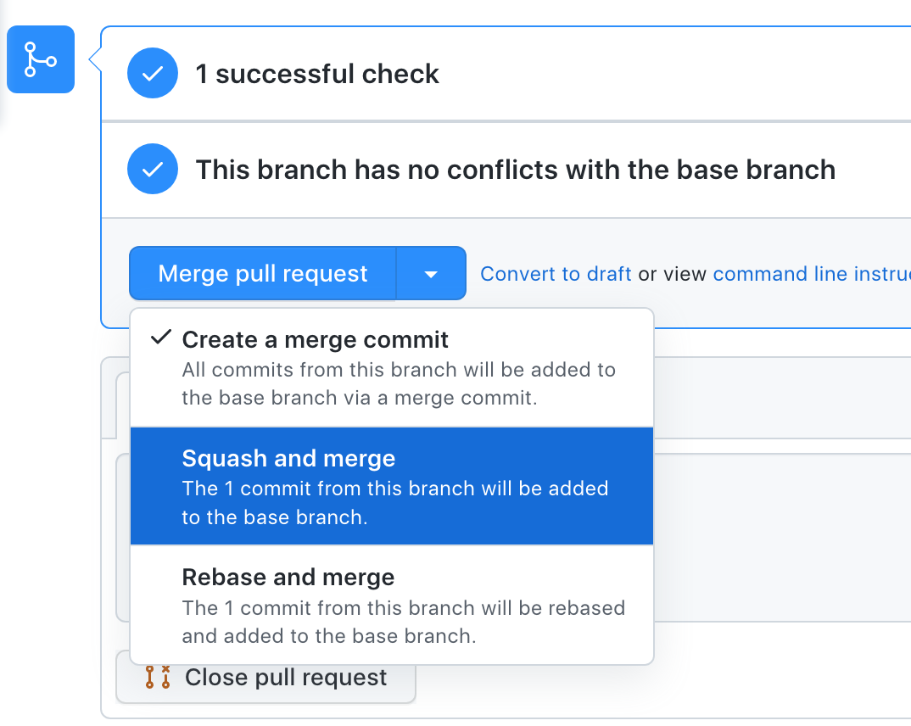

# Contributing to Ploomber

Thanks for considering contributing to Ploomber!

Issues tagged with [good first issue](https://github.com/ploomber/ploomber/issues?q=is%3Aissue+is%3Aopen+label%3A%22good+first+issue%22) are great options to start contributing.

If you get stuck, [open an issue](https://github.com/ploomber/ploomber/issues/new?title=CONTRIBUTING.md%20issue) or reach out to us on [Slack](https://ploomber.io/community/) and we'll happily help you.

If you're contributing to the documentation, go to [doc/CONTRIBUTING.md](doc/CONTRIBUTING.md).

To support your journey, check out our [blog post](https://ploomber.io/blog/open-source/) (you might read it in chunks as you make progress).

## Setup with conda

The easiest way to setup the development environment is via the setup command; you must have miniconda installed. If you don't want to use conda, skip to the next section.

[Click here for miniconda installation details](https://docs.conda.io/en/latest/miniconda.html).

Make sure conda has conda-forge as channel, running the following:

```sh
conda config --add channels conda-forge
```

Once you have conda ready:

```sh
# get the code
git clone https://github.com/ploomber/ploomber

# invoke is a library we use to manage one-off commands
pip install invoke

# move into ploomber directory
cd ploomber

# setup development environment
invoke setup
```

*Note:* If you're using Linux, you may encounter issues running `invoke setup` regarding the `psycopg2` package. If that's the case, remove `psycopg2` from the `setup.py` file and try again.

Then activate the environment:

```sh
conda activate ploomber
```

## Setup with pip

Ploomber has optional features that depend on packages that aren't straightforward to install, so we use `conda` for quickly setting up the development environment. But you can still get a pretty good development environment using `pip` alone.

### [Optional] Create virtual environment

**Note**: we highly recommend you to install ploomber in a virtual environment (the most straightforward alternative is the [venv](https://docs.python.org/3/library/venv.html) built-in module):

```sh
# create virtual env
python -m venv ploomber-venv

# activate virtual env (linux/macOS)
source ploomber-venv/bin/activate

# activate virtual env (windows)
.\ploomber-venv\Scripts\activate
```
*Note:* [Check venv docs](https://docs.python.org/3/library/venv.html#creating-virtual-environments) to find the appropriate command if you're using Windows.

### Install dependencies

```sh
# required to run the next command
pip install invoke

# install dependencies with pip
invoke setup-pip
```

*Note:* If you're using Linux, you may encounter issues running `invoke setup` regarding the `psycopg2` package. If that's the case, remove `psycopg2` from the `setup.py` file and try again.

### Caveats of installing with pip

Conda takes care of installing all dependencies required to run all tests. However, we need to skip a few of them when installing with pip because either the library is not pip-installable or any of their dependencies are. So if you use `invoke setup-pip` to configure your environment, some tests will fail. This isn't usually a problem if you're developing a specific feature; you can run a subset of the testing suite and let GitHub run the entire test suite when pushing your code.

However, if you wish to have a full setup, you must install the following dependencies:

1. [pygrapviz](https://github.com/pygraphviz/pygraphviz) (note that this depends on [graphviz](https://graphviz.org/)) which can't be installed by pip
2. [IRKernel](https://github.com/IRkernel/IRkernel) (note that this requires an R installation)

## Checking setup

Make sure everything is working correctly:

```sh
# import ploomber
python -c 'import ploomber; print(ploomber)'
```

*Note:* the output of the previous command should be the directory where you ran `git clone`; if it's not, try re-activating your conda environment (i.e., if using conda: `conda activate base`, then `conda activate ploomber`) If this doesn't work, [open an issue](https://github.com/ploomber/ploomber/issues/new?title=CONTRIBUTING.md%20issue) or reach out to us on [Slack](https://ploomber.io/community/).


Run some tests:

```
pytest tests/util
```

## Submitting code


We receive contributions via Pull Requests (PRs). [We recommend you check out this guide.](https://docs.github.com/en/github/collaborating-with-issues-and-pull-requests/about-pull-requests)


We use [yapf](https://github.com/google/yapf) for formatting code. *Please run yapf on your code before submitting*:

```sh
yapf --in-place path/to/file.py
```

We use [flake8](https://flake8.pycqa.org/en/latest/) for linting. *Please check your code with flake8 before submitting*:

```sh
# run this in the project directory to check code with flake8
# note: this takes a few seconds to finish
flake8
```
*Note:* If you created a virtual env in a child directory, exclude it from `flake8` using the `--exclude` argument (e.g., `flake8 --exclude my-venv`), `ploomber-venv` is excluded by default.

If you don't see any output after running `flake8`, you're good to go!

If you want git to automatically check your code with `flake8` before you push to your fork, you can install a pre-push hook locally:

```sh
# to install pre-push git hook
invoke install-git-hook

# to uninstall pre-push git hook
invoke uninstall-git-hook
```

The installed hook only takes effect in your current repository.

### Create Pull Requests

When you have finished the feature development and you are ready for a Code Review (a.k.a Pull Request in Github), make sure you `"squash"` the commits in your development branch before creating a PR

There are two ways to do that:

1. Squash all the commits in Command Line
2. Utilize Github PR page when you are about to merge to main branch

**1. Using Command Line: `git rebase`**

> [What is `git rebase`](https://www.delftstack.com/tutorial/git/git-rebase/#what-is-git-rebase)

```
$ git rebase -i <-i for interactive>

# "squash" the command history
# for example

pick commit_hash_1 commit_message_1
s    commit_hash_2 commit_message_2
s    commit_hash_3 commit_message_3
s    commit_hash_4 commit_message_4
```

**2. Using Github Console**

> [Squash and merge your pull request commits](https://docs.github.com/en/pull-requests/collaborating-with-pull-requests/incorporating-changes-from-a-pull-request/about-pull-request-merges#squash-and-merge-your-pull-request-commits)



## Tips for writing tests

* We use [pytest](https://docs.pytest.org/en/6.2.x/) for testing. A basic understanding of `pytest` is highly recommended to get started
* In most cases, for a given in `src/ploomber/{module-name}`, there is a testing module in `tests/{module-name}`, if you're working on a particular module, you can execute the corresponding testing module for faster development but when submitting a pull request, all tests will run
* Ploomber loads user's code dynamically via dotted paths (e.g., `my_module.my_function` is similar to doing `from my_module import my_function`). Hence, some of our tests do this as well. Dynamic imports can become a problem if tests create and import modules (i.e., create a new `.py` file and import it). To prevent temporary modules from polluting other tasks, use the `tmp_imports` pytest fixture, which deletes all packages imported inside a test
* Some tests make calls to a PostgreSQL database. When running on Github Actions, a database is automatically provisioned, but the tests will fail locally.
* If you're checking error messages and they include absolute paths to files, you may encounter some issues when running the Windows CI since the Github Actions VM has some symlinks. If the test calls `Pathlib.resolve()` ([resolves symlinks](https://docs.python.org/3/library/pathlib.html#id5)), call it in the test as well, if it doesn't, use `os.path.abspath()` (does not resolve symlinks).


## Conda releases

`ploomber` is available in conda (via [conda-forge](https://conda-forge.org/)). The recipes are located here:

* [ploomber](https://github.com/conda-forge/ploomber-feedstock)
* [ploomber-scaffold](https://github.com/conda-forge/ploomber-scaffold-feedstock)

The first feedstock corresponds to the core package, and the second is a complimentary package that implements the scaffolding logic (i.e., `ploomber scaffold`). When uploading a new version to PyPI, the conda-forge bot automatically opens a PR to the feedstocks; upon approval, the new versions are available to install via `conda install ploomber --channel conda-forge`.

Note that conda-forge implements a CI pipeline that checks that the recipe works. Thus, under most circumstances, the PR will pass. One exception is when adding new dependencies to `setup.py`; in such a case, we must manually edit the recipe (`meta.yml`) and open a PR to the feedstock. See the next section for details.

Note that [it takes some time](https://conda-forge.org/docs/maintainer/maintainer_faq.html#mfaq-anaconda-delay) for packages to be available for download. You can verify successful upload by opening Anaconda.org ([ploomber](https://anaconda.org/conda-forge/ploomber), [ploomber-scaffold](https://anaconda.org/conda-forge/ploomber-scaffold)); such website is updated immediately.

To check if packages are available: `conda search ploomber --channel cf-staging`. Pending packages will appear in channel [`cf-staging`](https://conda-forge.org/docs/maintainer/infrastructure.html#output-validation-and-feedstock-tokens) while available packages in `conda-forge`. It usually takes less than one hour for packages to move from one to the other.

### Manually updating the conda recipe

If `conda-forge`'s bot PR fails (usually because a new dependency was added), we must submit a PR ourselves:

1. [Fork feedstock repository](https://github.com/conda-forge/ploomber-feedstock)
2. Clone it: `git clone https://github.com/{your-user}/ploomber-feedstock` (change `your-user`)
3. Create a new branch: `git checkout -b branch-name`
4. Update recipe (`meta.yaml`):
    * Update the version in the `` line
    * Update `source.sha256`, you can get that from `https://pypi.org/project/ploomber/{version}/#files`, just change the `version` and copy the SHA256 hash from the `.tar.gz` file
    * If there are new dependencies (or new constraints), add them to `requirements.run`
5. You may need to run `conda smithy rerender -c auto` ([click here for details](https://conda-forge.org/docs/maintainer/updating_pkgs.html#rerendering-feedstocks))

[More details here](https://conda-forge.org/docs/maintainer/updating_pkgs.html)

If you already forked the repository, you can sync with the original repository like this:

```sh
git remote add upstream https://github.com/conda-forge/ploomber-feedstock
git fetch upstream
git checkout main
git merge upstream/main
```

## Maintaining backwards compatibility

We follow [scikit-learn's guidelines](https://scikit-learn.org/stable/developers/contributing.html#maintaining-backwards-compatibility).
