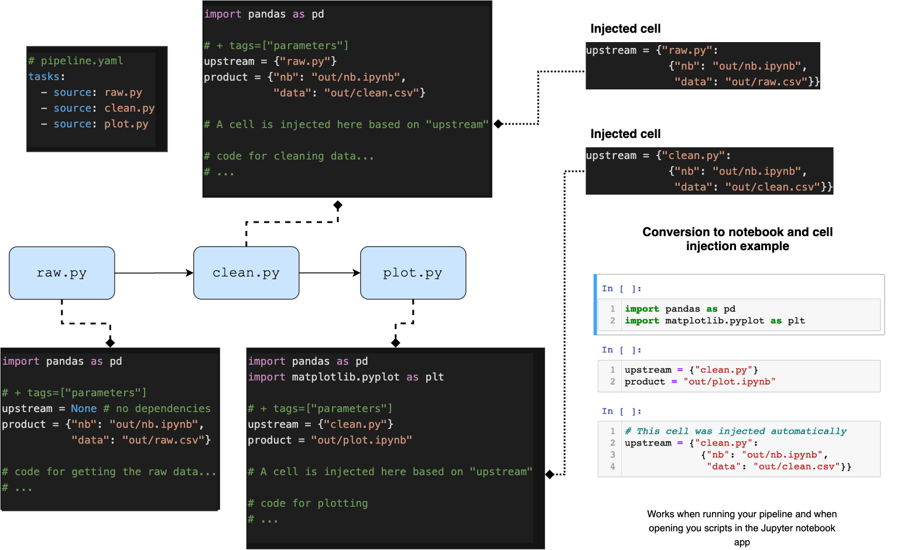
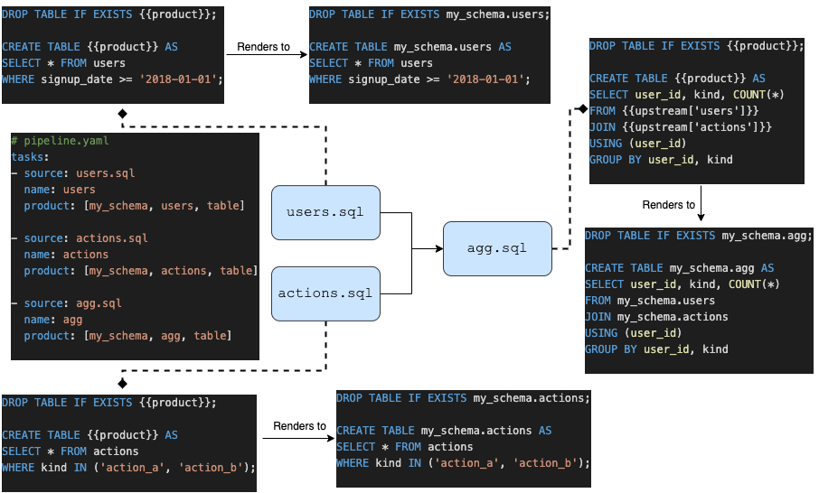

Ploomber
========

.. image:: https://travis-ci.org/ploomber/ploomber.svg?branch=master
    :target: https://travis-ci.org/ploomber/ploomber.svg?branch=master

.. image:: https://readthedocs.org/projects/ploomber/badge/?version=latest
    :target: https://ploomber.readthedocs.io/en/latest/?badge=latest
    :alt: Documentation Status

.. image:: https://mybinder.org/badge_logo.svg
 :target: https://mybinder.org/v2/gh/ploomber/projects/master

.. image:: https://badge.fury.io/py/ploomber.svg
  :target: https://badge.fury.io/py/ploomber

List your pipeline tasks in a ``pipeline.yaml`` file, declare which upstream tasks to use as inputs and where to save outputs. Ploomber will propagate inputs to downstream consumers and orchestrate pipeline end-to-end execution.

You can open your Python scripts as Jupyter notebooks for development. During execution, they are converted to notebooks to embed tables and charts:

1 minute video:

.. image:: https://asciinema.org/a/346484.svg
  :target: https://asciinema.org/a/346484

SQL pipelines are also supported:

(you can even mix SQL and Python in the same pipeline)

Ploomber also keeps track of source code changes to speed up builds by skipping up-to-date tasks. This is a great way to interactively develop your projects, sync work with your team and quickly recover from crashes (just fix the bug and build again).

`Try out the live demo (no installation required) <https://mybinder.org/v2/gh/ploomber/projects/master?filepath=spec%2FREADME.md>`_.

`Click here for documentation <https://ploomber.readthedocs.io/>`_.

`Our blog <https://ploomber.io/>`_.

Works with Python 3.5 and higher.

Installation
------------

.. code-block:: shell

    pip install ploomber

To install Ploomber along with all optional dependencies:

.. code-block:: shell

    pip install "ploomber[all]"

``graphviz`` is required for plotting pipelines:

.. code-block:: shell

    # if you use conda (recommended)
    conda install graphviz
    # if you use homebrew
    brew install graphviz
    # for more options, see: https://www.graphviz.org/download/

Create a new project
--------------------

.. code-block:: shell

    ploomber new

Python API
----------

There is also a Python API for advanced use cases. This API allows you build
flexible abstractions such as dynamic pipelines, where the exact number of
tasks is determined by its parameters.
